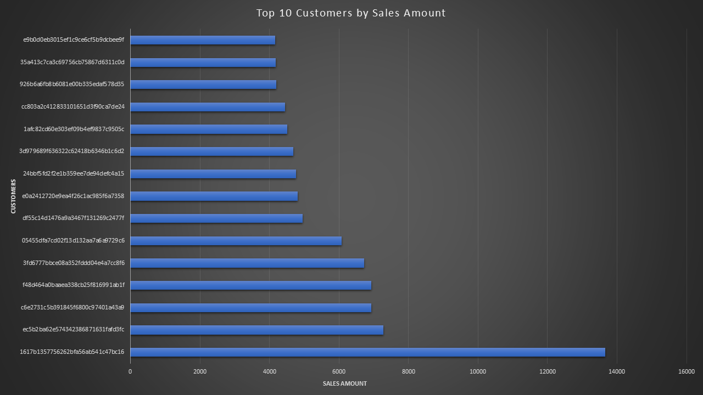

# Project Overview

This comprehensive data analysis project explores the Brazilian E-Commerce Public Dataset to uncover valuable business insights about customer behavior, product performance, payment patterns, and operational efficiency. Using SQL for data exploration and analysis, this project provides actionable recommendations to optimize business strategies.

SQL Queries? 
Check them out here: [Project Folder](sql_files)

# Background

## Data Source & Context
The dataset is sourced from the [Brazilian E-Commerce Public Dataset by Olist](https://www.kaggle.com/datasets/olistbr/brazilian-ecommerce) and contains detailed information on customer orders, product categories, payment methods, review scores, and delivery timelines—offering a comprehensive view of the Brazilian e-commerce landscape from 2016 to 2018.

## Project Genesis
This project was initiated to address critical business questions faced by e-commerce companies operating in competitive markets. By leveraging real transactional data from Olist, one of Brazil's largest department stores, the analysis aims to uncover patterns and insights that can drive strategic decisions across customer acquisition, retention, product management, and operational efficiency.

## Dataset Overview
The Olist dataset provides a rich, relational database containing:

- 100,000+ orders from 2016 to 2018

- Multiple marketplace relationships representing real business operations

- Complete customer journey data from order to delivery and review

- Geographic coverage across all Brazilian states

- Multiple business entities including customers, sellers, products, and reviews

## Business Relevance
In the rapidly evolving Brazilian e-commerce sector, understanding customer behavior, operational performance, and market trends is crucial for sustainable growth. This analysis provides actionable intelligence that can help businesses optimize their strategies, improve customer experiences, and enhance operational efficiency in one of Latin America's most dynamic digital markets.

## Key Questions Explored
Through structured SQL analysis, this project seeks to answer the following critical business questions:

### 1. Customer Value and Segmentation
"Who are our most valuable customers and where are they located?"

- Identifying high-value customer segments and their geographic distribution

### 2. Product Performance & Strategy

"Which product categories drive the most revenue and have the best customer satisfaction?"

- Analyzing revenue performance across product categories
- Correlating sales performance with customer satisfaction metrics

### 3. Payment Behavior & Preferences

"What payment methods do customers prefer and how do they correlate with order value?"

- Examining payment method popularity and customer preferences
- Analyzing the relationship between payment types and transaction values
- Understanding installment payment patterns and their impact on revenue

### 4. Sales Trends & Seasonality
"How do sales vary by month and are there specific seasonal patterns?"

- Identifying monthly revenue trends and seasonal peaks/valleys
- Understanding business cycles for inventory and marketing planning

### 5. Operational Efficiency & Logistics

"How efficient is our delivery process across different regions?"

- Measuring delivery performance and on-time rates by geographic location
- Analyzing freight costs and their relationship with delivery efficiency
- Identifying regional variations in logistics performance

### 6. Customer Loyalty & Retention

"What percentage of customers make repeat purchases and how valuable are they?"

- Calculating customer retention rates and repeat purchase behavior
- Analyzing the revenue contribution of loyal customers vs. one-time buyers
- Identifying opportunities to improve customer lifetime value

# Technical Implementation

## SQL Skills Demonstrated

- Complex Query Development: Advanced JOIN operations, CTEs, and subqueries

- Data Aggregation: GROUP BY, aggregate functions (SUM, AVG, COUNT)

- Window Functions: Analytical calculations and ranking

- Date/Time Analysis: EXTRACT, date manipulation for trend analysis

- Conditional Logic: CASE statements for customer segmentation

## Tools Used

- PostgreSQL: Primary database management system

- SQL: Core analysis language for data extraction and transformation

- VS Code: Development environment for query writing and testing

- Git & GitHub: Essential for version control, sharing my SQL scripts, and documenting the project workflow, ensuring transparency and collaboration.

# The Analysis
This project employed advanced SQL analytics to examine multiple dimensions of the Brazilian e-commerce ecosystem, providing deep insights into customer behavior, operational efficiency, and business performance.

## 1. Customer Value Analysis
### Objective: 
Identify high-value customer segments and their geographic distribution to optimize marketing strategies and resource allocation.

```sql
    SELECT 
        customers.customer_id,
        customers.customer_state AS state,
        customers.customer_city AS city,
        COUNT(orders.order_id) AS number_of_orders,
        SUM(op.payment_value) AS total_sales_amount
    FROM customers 
        INNER JOIN orders ON customers.customer_id = orders.customer_id
        INNER JOIN order_payments AS op ON orders.order_id = op.order_id
    GROUP BY
        customers.customer_id, customers.customer_state, customers.customer_city
    ORDER BY
        total_sales_amount DESC, number_of_orders DESC
    LIMIT 15;
```

### Methodology:

- Aggregated customer spending data across all orders
- Joined customer demographic data with transaction records
- Calculated total sales per customer with geographic segmentation
- Ranked customers by lifetime value and purchase frequency

### Key Findings:
- Top 15 customers contribute disproportionately to total revenue
- High-value customers are concentrated in southeastern states (RJ, ES, MS)
- 93% of top customers are single-purchase buyers, indicating a significant retention opportunity
- Only one customer in the top 15 made multiple purchases, highlighting a critical loyalty gap

### Business Impact: 

Enables targeted retention campaigns and geographic-focused marketing strategies.



*Bar graph visualizing the total sales for the Top 10 customers*

## 2. Product Performance Analysis

### Objective: 
Determine which product categories generate the most revenue and maintain high customer satisfaction to guide inventory and marketing decisions.

### SQL Query:

```sql
    SELECT
        products.product_category_name AS category_name,
        SUM(order_items.price) AS total_revenue,
        ROUND(AVG(order_reviews.review_score),1) AS average_review_score,
        COUNT(order_reviews.review_id) as review_count
    FROM 
        products INNER JOIN order_items ON products.product_id = order_items.product_id
        INNER JOIN order_reviews ON order_items.order_id = order_reviews.order_id
    GROUP BY
    category_name
    HAVING COUNT(order_reviews.review_id) > 10 
    ORDER BY
    total_revenue DESC, average_review_score DESC;
```

### Methodology:

- Joined product catalog with sales and review data
- Calculated total revenue and average review scores by category
- Applied minimum review count filter (10+ reviews) for statistical significance
- Sorted results by revenue and satisfaction metrics

### Key Findings:

- 'beleza_saude' (health/beauty) leads in revenue ($1.25M) but has moderate satisfaction (4.1★)
- 'relogios_presentes' (watches/gifts) follows closely in revenue ($1.19M)
- 'cds_dvds_musicais' achieves highest satisfaction (4.6★) despite lower revenue
- Categories with both high revenue and strong satisfaction represent optimal investment opportunities

### Business Impact: 
Informs product assortment strategies and quality improvement initiatives.


*Graph displaying Top 10 product categories by revenue*


*Graph displaying Top 10 product categories by revenue's review score by product category*

## 3. Payment Behavior Analysis

### Objective: 
Understand customer payment preferences and their relationship with order value to optimize payment processing and promotional strategies.

### SQL Query:

```sql
    SELECT 
        payment_type AS payment_method,
        ROUND(AVG(order_payments.payment_value),1) AS average_payment_value, 
        COUNT(*) AS payment_count,
        SUM(order_payments.payment_value) AS total_payment_value,
        ROUND(AVG(CASE 
            WHEN order_payments.payment_installments = 1 THEN order_payments.payment_value
            ELSE NULL
            END),1) AS avg_single_installment_value,       
        ROUND(AVG(CASE
            WHEN order_payments.payment_installments > 1 THEN order_payments.payment_value
            ELSE NULL
            END),1)AS avg_multiple_installments_value,
        ROUND(COUNT(*) * 100.0 / SUM(COUNT(*)) OVER(), 1) AS payment_percentage,
        ROUND(SUM(payment_value) * 100.0 / SUM(SUM(payment_value)) OVER(), 1) AS revenue_percentage,
        ROUND(AVG(order_payments.payment_installments),1) AS avg_number_of_installments,
        COUNT(CASE
            WHEN order_payments.payment_installments =1 THEN order_payments.payment_installments
            ELSE NULL
            END) AS single_installment_count,
        COUNT(CASE
                WHEN order_payments.payment_installments > 1 THEN order_payments.payment_installments
                ELSE NULL
                END) AS multiple_installment_count,
        CASE 
        WHEN COUNT(*) * 100.0 / SUM(COUNT(*)) OVER() > 50 THEN 'Market Leader'
        WHEN COUNT(*) * 100.0 / SUM(COUNT(*)) OVER() > 20 THEN 'Major Player'
        ELSE 'Niche Method'
        END AS market_position
    FROM order_payments
    GROUP BY
        payment_method  
    ORDER BY
        total_payment_value DESC, payment_count DESC;
```

### Methodology:

- Analyzed payment method distribution and average transaction values
- Calculated installment payment patterns and their impact on order size
- Created market position categories based on payment method popularity
- Computed revenue contribution percentages across payment types

### Key Findings:

- Credit cards dominate with 73.9% of transactions and 78.3% of total revenue
- Installment payments drive 105% higher average order value ($197 vs $96 single payment)
- Boleto serves as the primary alternative with 19% market share
- Clear payment tiers exist: credit card (premium), boleto (mid-market), voucher/debit (low-value)
- Business Impact: Guides payment processor investments and installment promotion strategies.


*Graph displaying payment percentage by payment method*


## 4. Sales Trends & Seasonality Analysis

### Objective: 
Identify seasonal patterns and monthly performance variations to optimize inventory planning and marketing calendar.

### SQL Query:

```sql
    SELECT
        EXTRACT(YEAR FROM orders.order_purchase_timestamp) AS order_year,
        EXTRACT(MONTH FROM orders.order_purchase_timestamp) AS order_month,
        TO_CHAR(orders.order_purchase_timestamp, 'Month') AS month_name,
        SUM(order_items.price) AS total_revenue,
        COUNT(orders.order_id) AS total_orders,
        AVG(order_items.price) AS avg_order_value,
        COUNT(DISTINCT orders.customer_id) AS unique_customers
    FROM
        orders INNER JOIN order_items ON orders.order_id = order_items.order_id
    GROUP BY
        order_year, order_month, month_name
    ORDER BY
        order_year, order_month;
```

### Methodology:

- Extracted year and month components from order timestamps
- Calculated monthly revenue, order volume, and average order value
- Tracked unique customer counts to measure engagement patterns
- Analyzed year-over-year growth trajectories

### Key Findings:

- November emerges as the peak revenue month, indicating strong holiday shopping season
- Consistent upward trend in average order value throughout each year
- Customer engagement peaks align with major promotional periods
- Identifiable off-peak months present opportunities for targeted campaigns

### Business Impact: 
Enables data-driven inventory management and strategic campaign timing.


## 5. Shipping Efficiency Analysis

### Objective: 
Evaluate delivery performance across different regions to identify operational bottlenecks and service level variations.

### SQL Query:

```sql
SELECT
    customers.customer_state,
    customers.customer_city,
    ROUND(AVG(EXTRACT(DAY FROM (orders.order_delivered_customer_date - orders.order_purchase_timestamp))),0) AS avg_delivery_time_days,
    ROUND(AVG(EXTRACT(DAY FROM (orders.order_estimated_delivery_date - orders.order_delivered_customer_date))),0) AS avg_days_early_positive_late_negative,
    ROUND(COUNT(CASE WHEN orders.order_delivered_customer_date <= orders.order_estimated_delivery_date THEN 1 END) * 100.0 / COUNT(orders.order_id), 0) AS on_time_delivery_percentage,
    ROUND(AVG(order_items.freight_value),0) AS avg_freight_cost,
    ROUND(SUM(order_items.freight_value),0)AS total_freight_revenue,
    COUNT(orders.order_id) AS total_orders,
    COUNT(DISTINCT customers.customer_id) AS unique_customers
FROM customers
    INNER JOIN orders ON customers.customer_id = orders.customer_id
    INNER JOIN order_items ON orders.order_id = order_items.order_id
WHERE orders.order_delivered_customer_date IS NOT NULL
GROUP BY
    customers.customer_state, customers.customer_city
ORDER BY
    avg_delivery_time_days ASC;
```

### Methodology:

- Calculated actual vs. estimated delivery time differences
- Computed on-time delivery percentages by city and state
- Analyzed freight costs relative to delivery performance
- Correlated delivery efficiency with geographic and order volume factors

### Key Findings:

- Major revenue states (SP, RJ) show slower delivery times (7-14 days) but maintain >94% on-time rates
- Southern states (SC, PR) demonstrate optimal balance: fast delivery (4-6 days) with 100% on-time performance
- Higher freight costs don't necessarily correlate with faster delivery times
- Significant operational risk exists due to heavy dependence on slower, high-volume regions

### Business Impact:
 Identifies logistics optimization opportunities and regional service improvements.

## 6. Customer Retention Analysis

### Objective: 
Measure customer loyalty patterns and the economic value of repeat purchasers to guide retention strategy investments.

### SQL Query:

```sql
    WITH customer_orders AS (
        SELECT
            customers.customer_id,
            COUNT(orders.order_id) AS total_orders,
            SUM(order_items.price) AS total_spent
        FROM 
            customers
            INNER JOIN orders ON customers.customer_id = orders.customer_id
            INNER JOIN order_items ON orders.order_id = order_items.order_id
        GROUP BY
            customers.customer_id
    )


    SELECT
        COUNT(DISTINCT CASE 
            WHEN customer_orders.total_orders > 1 THEN customer_orders.customer_id
            ELSE NULL
        END) AS repeat_customers,
        COUNT(DISTINCT customer_orders.customer_id) AS total_customers,
        ROUND(
            COUNT(DISTINCT CASE 
                WHEN customer_orders.total_orders > 1 THEN customer_orders.customer_id
                ELSE NULL
            END) * 100.0 / COUNT(DISTINCT customer_orders.customer_id), 2
        ) AS repeat_purchase_percentage,
        SUM(CASE 
            WHEN customer_orders.total_orders > 1 THEN customer_orders.total_spent
            ELSE 0
        END) AS total_revenue_from_repeat_customers,
        SUM(customer_orders.total_spent) AS total_revenue,
        ROUND(
            SUM(CASE 
                WHEN customer_orders.total_orders > 1 THEN customer_orders.total_spent
                ELSE 0
            END) * 100.0 / SUM(customer_orders.total_spent), 2
        ) AS revenue_percentage_from_repeat_customers   
    FROM 
        customer_orders;


    -- customer tier analysis

    WITH customer_orders AS (
        SELECT
            customers.customer_id,
            COUNT(orders.order_id) AS total_orders,
            SUM(order_items.price) AS total_spent
        FROM 
            customers
            INNER JOIN orders ON customers.customer_id = orders.customer_id
            INNER JOIN order_items ON orders.order_id = order_items.order_id
        GROUP BY
            customers.customer_id
    )

    SELECT
        CASE 
            WHEN total_orders = 1 THEN 'One-time'
            WHEN total_orders = 2 THEN 'Returning' 
            WHEN total_orders >= 3 THEN 'Loyal'
        END AS customer_tier,
        COUNT(*) AS customer_count,
        AVG(total_spent) AS avg_spent
    FROM customer_orders
    GROUP BY customer_tier;
```

### Methodology:

- Calculated repeat purchase rates and customer lifetime value
- Segmented customers into tiers: one-time, returning, and loyal
- Compared revenue contribution between new and repeat customers
- Analyzed spending patterns across customer segments

### Key Findings:

- Only 9.94% of customers make repeat purchases, but they generate 14.76% of total revenue
- Repeat customers are 50% more valuable than new customers ($204 vs $135 average spend)
- Heavy reliance on new customer acquisition (90% of customer base)
- A significant growth opportunity exists in converting one-time buyers to repeat purchasers

### Business Impact:
 Provides compelling business case for loyalty program investments and retention initiatives.


 | repeat_customers | total_customers | repeat_purchase_rate | total_revenue_from_repeat_customers | total_revenue | revenue_percentage |
|------------------:|----------------:|----------------------:|------------------------------------:|---------------:|-------------------:|
| 9803              | 98666           | 9.94                 | 2005862.42                          | 13591643.70    | 14.76              |

*Table showing customer retention analysis*

# What I learned

Throughout this project, I significantly enhanced my SQL and data analysis capabilities:

### Advanced Query Development: 
Mastered complex SQL operations, including multi-table JOINs across customer, order, product, and payment datasets, and implemented Common Table Expressions (CTEs) for sophisticated data manipulation and modular query structures.

### Data Aggregation & Analysis: 
Developed strong skills in using GROUP BY clauses and aggregate functions (COUNT, AVG, SUM) to transform raw e-commerce data into meaningful business insights and performance metrics.

### Analytical Methods & Techniques:
Implemented conditional logic using CASE statements for advanced customer segmentation and business rule application. Leveraged window functions for ranking and comparative analysis, and applied date/time functions for sophisticated trend analysis and seasonality detection.

### Business Intelligence Translation: 
Strengthened my ability to translate real-world e-commerce challenges into structured SQL queries that deliver actionable insights and data-driven recommendations for customer retention, product strategy, and operational efficiency.

### E-commerce Domain Expertise: 
Gained a comprehensive understanding of online retail metrics, including customer lifetime value, payment behavior patterns, seasonal trends, and logistics performance analysis.

### Analytical Problem-Solving: 
Enhanced my capability to solve complex business problems by breaking them down into data-driven questions and creating SQL solutions that provide clear, actionable answers for strategic decision-making.

# Conclusion

This Brazilian E-Commerce Data Analysis project successfully demonstrates the power of SQL in transforming raw business data into actionable strategic insights. Through comprehensive analysis of customer behavior, product performance, payment patterns, and operational efficiency, this project provides a complete framework for data-driven decision-making in the competitive e-commerce landscape.

### Key Business Impact

The analysis reveals critical opportunities for revenue growth and operational improvement, particularly in customer retention strategies where repeat customers prove to be 50% more valuable than new ones. The findings around payment preferences and product category performance offer clear guidance for resource allocation and strategic focus areas.

### Technical Achievement

From a technical perspective, this project showcases advanced SQL capabilities, including complex multi-table joins, sophisticated aggregation methods, and analytical functions that can be applied to real-world business challenges. The structured approach to query development and analysis provides a replicable framework for future data analytics projects.

### Future Applications

The methodologies and insights generated here extend beyond e-commerce to any data-rich business environment. The skills demonstrated—from data extraction and transformation to insight generation and strategic recommendation—form a foundation for continued growth in data analytics and business intelligence roles.

<<<<<<< HEAD
This project not only delivers immediate value through its specific findings but also establishes a proven approach for leveraging data to drive business success in any customer-focused organization.
=======
This project not only delivers immediate value through its specific findings but also establishes a proven approach for leveraging data to drive business success in any customer-focused organization.
>>>>>>> 0086222e0f1a3ad290aa39d72db9d70334ae1493
